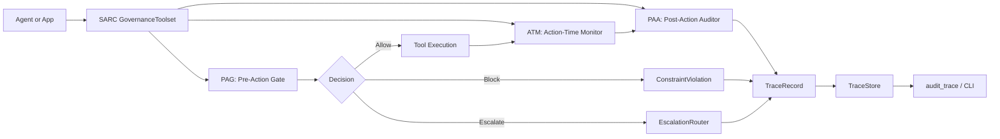

# sarc-governance

<p align="center">
  <picture>
    <source media="(prefers-color-scheme: dark)" srcset="assets/logo/sarc-logo-dark.svg">
    
  </picture>
</p>


[](http://mypy-lang.org/)
[](https://arxiv.org/abs/2605.07728)
[](https://doi.org/10.5281/zenodo.20642182)

A runtime governance layer that wraps any async toolset and enforces declarative
constraints (hard / soft / escalation) at three in-process points around every tool call.

> **Status — read this first.** Developer toolkit + pre-production
> foundations on top of the SARC architecture from *"SARC: A Governance-by-Architecture
> Framework for Agentic AI Systems"*
> ([`paper/`](paper/README.md)). Stable enough for prototypes,
> evaluation, serious POCs, and as the runtime spine of a hardened
> deployment. **It is not a turnkey production system.** The hash chain
> is *tamper-evident, not tamper-proof*; `approval_status="approved"` is
> a string that the deploying organisation's CI/CD must enforce; the
> shipped trace stores are single-writer; the default escalation router
> only logs. See [docs/mental-model.md](docs/mental-model.md) for the
> full "is / is not" map and
> [docs/production-hardening.md](docs/production-hardening.md) for what
> remains your responsibility.

## Start here

- [Mental model](docs/mental-model.md) — what `sarc-governance` is and is not, in one page.
- [Quickstart for developers](docs/quickstart-for-developers.md) — 10-minute path from clone to first governed call.
- [FAQ](docs/faq.md) — does it call cloud providers, replace Bedrock, make logs tamper-proof, etc.
- [Integration checklist](docs/integration-checklist.md) — the decisions you have to make before shipping.
- [Policy cookbook](docs/policy-cookbook.md) — copy-paste YAML recipes for common governance patterns.

## Reference docs

- [Architecture](docs/architecture.md) — SARC loop, components, class × point compatibility.
- [Spec authoring](docs/spec-authoring.md) — YAML schema, predicates, common mistakes.
- [Audit traces](docs/audit-traces.md) — trace shapes, `audit_trace` semantics, CI workflow.
- [Integrations](docs/integrations.md) — KAOS PAIS, LangGraph-style, OpenAI tool calling, AWS Bedrock action groups, generic async toolsets.
- [PAIS integration](docs/pais-integration.md) — `create_governed_agent_server`, `PAISContextMapper`, `PAISMemoryGuard`, full KAOS deployment guide.
- [MCP tool governance](docs/mcp-tool-governance.md) — governing MCP tools via the adapter pattern.
- [CLI reference](docs/cli.md) — validate, audit, policy diff, trace verify-chain, and more.
- [Pre-production checklist](docs/pre-production-checklist.md) — what now ships vs. what you still wire up.
- [Trace stores](docs/trace-stores.md) — Memory / JSONL / SQLite backends and the hash chain.
- [Production hardening](docs/production-hardening.md) — persistence, observability, auth, perf, CI/CD.
- [Repository layout](docs/repo-layout.md) — full directory structure with descriptions.
- [POC use cases](docs/use-cases.md) — procurement, data access, refunds, incident response.
- [Positioning](docs/positioning.md) — how SARC compares to logging, guardrails, OPA, etc.

---

## Architecture



`GovernanceToolset` wraps any async toolset. Add it with `GovernanceToolset(wrapped=your_toolset, spec=your_spec)` — enforcement and trace emission are automatic.

---

## Concepts

| Concept | Description |
|---|---|
| **ConstraintClass** | `hard` · `soft` · `escalation` |
| **EnforcementPoint** | `PAG` (Pre-Action Gate) · `ATM` (Action-Time Monitor) · `PAA` (Post-Action Auditor) · `ER` (Escalation Router) |
| **ConstraintSpec** | Validated, immutable bundle of constraints; drives enforcement and audit |
| **GovernanceToolset** | Wraps any async toolset; enforces constraints at PAG/ATM/PAA |
| **EscalationRouter** | Pluggable async handler; default is structured logging |
| **audit_trace** | Checks coverage, placement, response, and attribution of a recorded trace |

### Class-to-point compatibility (paper §4.2, Table 1)

| Class | Allowed points |
|---|---|
| `hard` | PAG, ATM |
| `soft` | ATM, PAA |
| `escalation` | PAG, PAA |

---

## Quickstart

```bash
git clone https://github.com/besanson/sarc-governance.git
cd sarc-governance
pip install -e ".[dev]"
pytest
python examples/procurement_agent/run_demo.py
```

No external services. No API keys. The procurement demo prints per-scenario outcomes and a final SARC audit summary. See [docs/quickstart-for-developers.md](docs/quickstart-for-developers.md) for the full path.

---

## Minimal example: wrap an async toolset

```python
import asyncio
from sarc_governance import (
    Constraint, ConstraintSpec, GovernanceToolset,
    EscalationRouter, ConstraintViolation,
)

class MyToolset:
    async def call_tool(self, name, args, ctx, tool):
        return {"status": "ok", "tool": name, "args": args}

spec = ConstraintSpec(constraints=[
    Constraint(
        id="ch_high_value_po",
        klass="hard",
        verif="PAG",
        response="block_or_escalate",
        predicate=lambda ctx: (
            ctx["tool"] == "erp.create_po"
            and ctx["args"].get("amount", 0) >= 50_000
        ),
        description="Block purchase orders >= $50,000 before dispatch.",
    ),
])

governed = GovernanceToolset(wrapped=MyToolset(), spec=spec)

async def main():
    try:
        await governed.call_tool("erp.create_po", {"amount": 75_000})
    except ConstraintViolation as exc:
        print(f"blocked at {exc.point.value}: {exc.constraint_id}")

asyncio.run(main())
```

A YAML version of the same spec is loadable via `sarc_governance.specs.load_spec(path)`.

---

## Framework-agnostic by design

**`sarc-governance` does not import any specific agent framework.** KAOS, LangGraph, OpenAI,
boto3 / Bedrock, pydantic-ai, and similar libraries are all optional — none are required.
The package depends only on `pyyaml` plus the standard library.

`GovernanceToolset` wraps **any** object with an async `call_tool` method. The KAOS/PAIS
adapter (`create_governed_agent_server`) governs all toolsets in a KAOS deployment without
any KAOS source modification — see [docs/pais-integration.md](docs/pais-integration.md).
See [docs/integrations.md](docs/integrations.md) for LangGraph, OpenAI, and Bedrock examples.

---

## Limitations

SARC is a developer toolkit and research artifact. Before deploying in a regulated or high-stakes environment, read these limitations:

- **Not a replacement for IAM.** SARC does not authenticate callers or authorize access. It enforces constraints on tool-call arguments.
- **Not a replacement for secure sandboxing.** Predicates are arbitrary Python callables evaluated in-process. A malicious spec is malicious code.
- **Not a complete prompt-injection defense.** SARC does not parse model outputs. Prompt injection that changes tool arguments can still trigger a constraint; prompt injection that injects a new tool call is governed only if that tool call reaches GovernanceToolset.
- **Not a distributed transaction system.** The shipped trace stores are single-writer. Multi-agent scenarios with shared state require application-level coordination.
- **Trace integrity depends on deployment choices.** The hash chain is tamper-evident, not tamper-proof. verify-chain detects tampering after the fact; it is not a real-time integrity monitor.
- **Policy correctness depends on policy authors.** A predicate that always returns False is a silent governance gap. Test your predicates.

See [docs/threat-model.md](docs/threat-model.md) for the full threat model.

---

## Paper

The LaTeX source for the SARC paper is in [`paper/`](paper/README.md). The architecture
described there maps 1:1 onto the modules in `src/sarc_governance/`. Cite with
[`CITATION.cff`](CITATION.cff) or see the [arXiv preprint](https://arxiv.org/abs/2605.07728).

---

## License

MIT — see [`LICENSE`](LICENSE).
