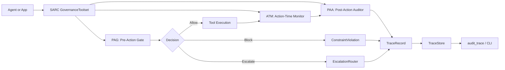
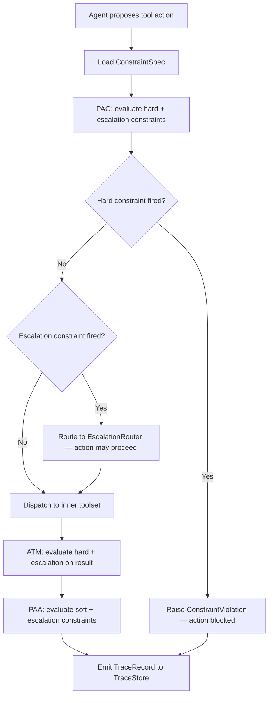
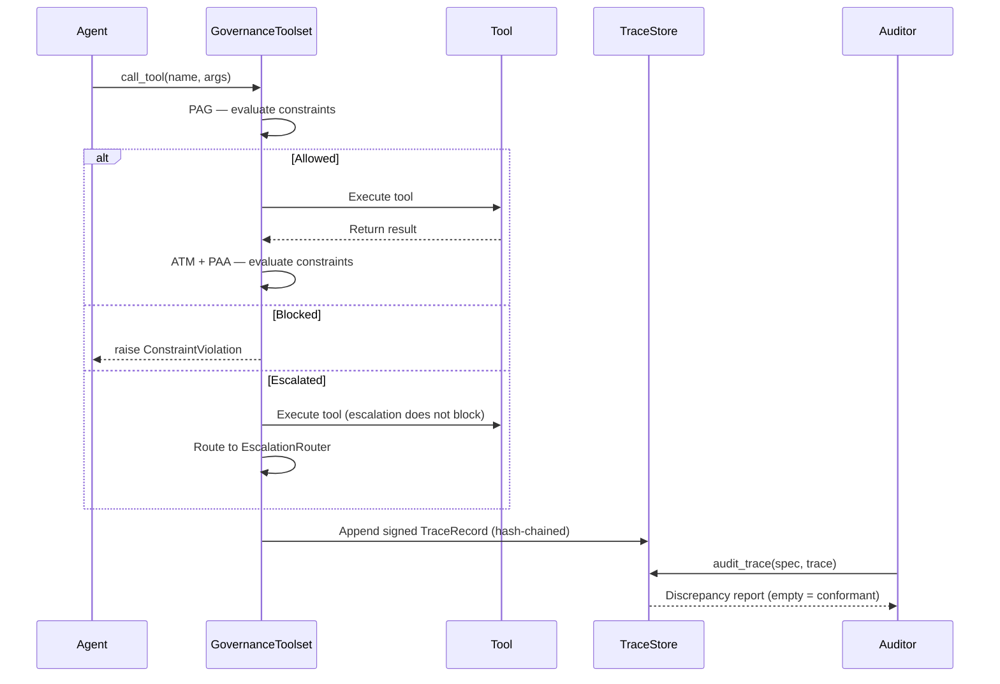

# Architecture

`sarc-governance` implements the SARC runtime governance architecture from the
SARC paper. It is a thin, framework-neutral library that interposes on
every tool dispatch and enforces declarative constraints at three points
around the call.

## The SARC loop

```
                      +-------------------------------+
   tool request ----> |       GovernanceToolset       |  <----- ConstraintSpec
                      |                               |
                      |    PAG (Pre-Action Gate)      |  hard / escalation
                      |       v                       |
                      |    ATM (Action-Time Monitor)  |  hard / escalation
                      |       v                       |
                      |    inner toolset call         |
                      |       v                       |
                      |    PAA (Post-Action Auditor)  |  soft / escalation
                      +---------------+---------------+
                                      |
                                      v
                                 ER (router)
                                      |
                                      v
                                 trace memory
```

Three points, three classes, two orthogonal concerns: when to evaluate
(`EnforcementPoint`) and how strict (`ConstraintClass`).

## Class × point compatibility (paper §4.2, Table 1)

| Class | Allowed points | Why |
|---|---|---|
| `hard` | `PAG`, `ATM` | Must be able to prevent or interrupt execution. |
| `soft` | `ATM`, `PAA` | Observes the action; never blocks. |
| `escalation` | `PAG`, `PAA` | Routes events asynchronously, before or after. |

Constructing a `Constraint` with an incompatible pair raises `ValueError`
at definition time; a runtime trace that records an evaluation at an
incompatible point is flagged by `audit_trace` as a placement discrepancy.

## Components

| Component | Module | Role |
|---|---|---|
| `Constraint`, `ConstraintSpec` | `sarc_governance.constraints` | Declarative governance unit; immutable, validated. |
| `GovernanceToolset` | `sarc_governance.governance` | Wraps any `ToolsetProtocol`; enforces PAG/ATM/PAA. |
| `EscalationRouter` (ER) | `sarc_governance.escalation` | Async dispatcher for fired escalation events. |
| `TraceRecord`, `ActionEvent` | `sarc_governance.trace` | Per-evaluation audit record. |
| `audit_trace` | `sarc_governance.audit` | Offline I1 (coverage) / I2 (placement) / I3 (response) checker. |
| Predicate registry | `sarc_governance.predicates` | Named, code-by-reference predicates loaded from YAML. |
| Spec loader | `sarc_governance.specs` | YAML/JSON → `ConstraintSpec`, no `eval`. |
| CLI | `sarc_governance.cli` | `validate` / `list-predicates` / `audit` / `demo`. |

## SARC is orchestration-agnostic

SARC Governance is a *governance* layer, not an *orchestration* layer. It does
not run the agent loop, plan tool calls, or talk to a model — it sits at
the boundary where some other system has already decided which tool to
call and is about to dispatch it. LangGraph, OpenAI tool calling, AWS
Bedrock action groups, and any custom orchestrator are all valid above
this boundary; SARC wraps the boundary the same way for each.

```
   model / planner          orchestration layer            governance layer            downstream
  (whichever you use)   (LangGraph / OpenAI /            (sarc-governance, this lib)        (DB / API / ERP /
                         Bedrock / your own loop)                                      payments / …)
        │                          │                              │                          │
        │  produces tool call      │                              │                          │
        │ ─────────────────────►   │  framework-shaped event      │                          │
        │                          │ ───────────────────────►     │  (name, args, ctx)        │
        │                          │                              │  PAG ─► ATM ─► inner ─► PAA
        │                          │                              │ ─────────────────────────►
        │                          │  framework-shaped response   │  result or violation      │
        │  ◄─────────────────────  │ ◄──────────────────────────  │ ◄──────────────────────── │
```

The arrows in the middle column are framework-specific (action-group
events, LangGraph state mutation, OpenAI tool messages, custom toolset
calls). The arrows in the right column are uniform — that uniformity is
what makes the same `ConstraintSpec` portable across deployments.

### Zero-adapter case

Any orchestration whose toolset already exposes
`call_tool(name, tool_args, ctx, tool)` (an in-house async toolset class,
or any framework whose toolset shape happens to match) needs no adapter:

1. **No adapter code is needed.** Pass the toolset to
   `GovernanceToolset(wrapped=...)` and the agent loop is unchanged.
2. **Trace persistence auto-detects** `ctx.deps.memory` and
   `ctx.deps.session_id` when the context object exposes that shape. If
   your project shape is different, supply `memory_getter=` and
   `session_id_getter=` callables instead.

### Mapping to other shapes

Other framework shapes (LangGraph, OpenAI tool calling, AWS Bedrock
action groups) need a small adapter object that implements
`ToolsetProtocol` over their native dispatch and (for Bedrock) a thin
event-normalize / response-build pair around it. See
[`integrations.md`](integrations.md) for the patterns and a side-by-side
comparison.

> SARC Governance does **not** import LangGraph, OpenAI, boto3 / Bedrock, or
> any other agent framework. The library depends only on `pyyaml` plus
> the standard library. Pick whichever orchestration fits the
> deployment; the governance surface is identical.

## Trace record schema

Every evaluation produces one `TraceRecord` with these fields:

| Field | Type | Notes |
|---|---|---|
| `action_id` | str | Per-invocation identifier; shared across PAG/ATM/PAA records. |
| `tool` | str | The tool name. |
| `point` | str | `PAG` / `ATM` / `PAA`. |
| `constraint_id` | str | `Constraint.id`. |
| `class` | str | Denormalised; saves a spec lookup at audit time. |
| `fired` | bool | Predicate result. |
| `response` | str | Constraint's declared response. |
| `timestamp` | float | `time.time()`. |
| `extra` | dict | Optional. ATM records carry `{"elapsed": float}`. |

`audit_trace` also accepts the higher-level "action-level" schema used by
`benchmarks/sarc_eval.py`; it is auto-detected.

## What the library deliberately does *not* do

- Decide outcomes after escalation. The router routes; a paired `hard`
  constraint reading a ledger is the actual gate. See
  [`examples/human_escalation/`](../examples/human_escalation/README.md).
- Persist anything beyond the in-process `MemoryProtocol` you supply.
- Sandbox predicates. `Constraint.predicate` is arbitrary Python; treat
  spec content as code, not data.
- Provide retries, backoff, or idempotency around the inner toolset.
- Coordinate concurrent agents. A `GovernanceToolset` is single-actor.

## Architecture diagram



`GovernanceToolset` wraps any async toolset. Add it with `GovernanceToolset(wrapped=your_toolset, spec=your_spec)` — enforcement and trace emission are automatic.

## Decision flow



## Audit trace lifecycle


