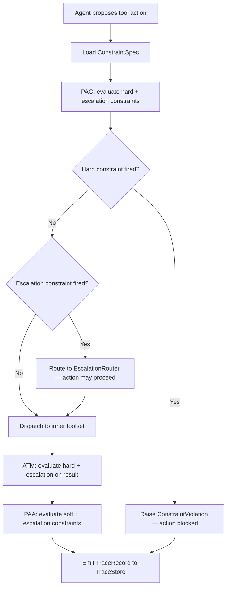

# What `sarc-governance` is, and what it is not

A single page so a senior engineer can decide in two minutes whether this
library is in scope for their problem.

## What it is

`sarc-governance` is a small Python library that wraps a single async
method — `call_tool(name, args, ctx, tool)` — and runs declarative
constraints around it at three points:

- **PAG** (Pre-Action Gate) — before the inner call. `hard` constraints
  here can raise and block the call.
- **ATM** (Action-Time Monitor) — measures the inner call.
- **PAA** (Post-Action Auditor) — after the inner call returns. `soft`
  and `escalation` constraints can observe or route on the result.

Every evaluation produces a `TraceRecord`. Records can be persisted via
a user-supplied `MemoryProtocol` or one of three shipped trace stores
(memory / JSONL / SQLite). With `hash_chain=True`, records are linked
by SHA-256 so post-hoc edits are detectable.

That is the whole product. The rest of the library is helper code
(spec loader, predicate registry, CLI, audit checker, policy
metadata + diff) for building, shipping, and reviewing the constraint
spec that drives those evaluations.

## Decision flow



This is how `[OK]`, `[BLOCKED]`, and `[OK+ESC]` in the demo output map to the enforcement loop.

## What it is not

| It is not | What that means |
|---|---|
| An agent framework | It does not plan, call models, or orchestrate. It interposes on a tool dispatch that *something else* already decided to make. |
| A managed service | No SaaS, no daemon, no network calls. It runs in the same process as your agent loop. |
| A certified integration with Bedrock / LangGraph / OpenAI | It is *framework-agnostic*. The shipped adapters are reference patterns that show how to wrap a `(name, args)` boundary; they import no third-party SDK. |
| A sandbox for predicates | `Constraint.predicate` is arbitrary Python evaluated in-process. Treat spec content as code. |
| A storage system | The shipped trace stores are single-writer and intended for tests, demos, single-process logging, and as a starting point. Multi-writer durable storage is the deploying organisation's job. |
| Tamper-proof | The hash chain is *tamper-evident*: it makes silent edits detectable by anyone who recomputes it, but it does not prevent edits. Tamper-proofness needs write-once storage or an external timestamping authority. |
| Approval enforcement | `PolicyMetadata.approval_status` is a string the library validates is one of `draft / in_review / approved / deprecated`. It does not check signatures or talk to an approval system. CI/CD is what enforces "approved". |
| A bypass-resistant guard | If your agent dispatches a tool without going through `GovernanceToolset`, that tool call is **not** governed. SARC protects the dispatch path it wraps; it does not stand between an agent and the operating system. |

## Where it sits

```
   model / planner          orchestration layer            governance layer            downstream
                          (LangGraph / OpenAI /        (sarc-governance)            (DB / API / ERP /
                          Bedrock / your own loop)                                  payments / …)
        │                         │                              │                          │
        │  produces tool call     │                              │                          │
        │ ────────────────────►   │  framework-shaped event      │                          │
        │                         │ ───────────────────────►     │  (name, args, ctx)        │
        │                         │                              │  PAG ─► ATM ─► inner ─► PAA
        │                         │                              │ ─────────────────────────►
        │                         │  framework-shaped response   │  result or violation      │
        │  ◄─────────────────────  │ ◄──────────────────────────  │ ◄──────────────────────── │
```

The library does not run the agent loop. It is a thin layer between the
orchestration's tool-dispatch boundary and the downstream system that
actually has side-effects.

## What you can run today

- `pytest` — 190 tests across constraint validation, governance,
  escalation, audit, predicates, trace, CLI, examples, hash chain,
  policy lifecycle, trace stores, execution context.
- `python examples/procurement_agent/run_demo.py` — six scenarios
  against a mock ERP toolset; in-process audit summary.
- `python examples/preproduction_trace_store/run_demo.py` — SQLite
  trace store + hash chain + JSONL export + policy diff.
- `python examples/human_escalation/run_demo.py` — approve / deny /
  timeout pattern using a paired escalation/PAG + hard/PAG ledger.
- `python examples/langgraph_style_adapter/run_demo.py` — adapter
  pattern for a LangGraph-shaped tools node (no `langgraph`
  dependency).
- `python examples/openai_tool_calling_adapter/run_demo.py` — adapter
  pattern for OpenAI-style tool dispatch (no `openai` dependency).
- `python examples/bedrock_action_group_adapter/run_demo.py` — adapter
  pattern for an AWS Bedrock action-group Lambda (no `boto3`
  dependency).
- `sarc-governance validate / list-predicates / audit / policy
  inspect / policy diff / trace verify-chain / trace export / demo
  procurement` — CLI subcommands. The CI-friendly ones (`audit`,
  `policy diff --exit-code`, `trace verify-chain`) exit non-zero on
  discrepancies.

Everything above runs offline. No API keys, no cloud calls, no daemon.

## Status of each piece

| Piece | Status | Read this |
|---|---|---|
| Constraint model + class/point compatibility | Stable | [`docs/architecture.md`](architecture.md) |
| `GovernanceToolset` PAG/ATM/PAA enforcement | Stable | [`docs/architecture.md`](architecture.md) |
| Spec YAML loader + predicate registry | Stable | [`docs/spec-authoring.md`](spec-authoring.md) |
| `audit_trace` + CLI | Stable | [`docs/audit-traces.md`](audit-traces.md) |
| `ExecutionContext` | Pre-production foundation | [`docs/pre-production-checklist.md`](pre-production-checklist.md) |
| `PolicyMetadata`, checksum, diff | Pre-production foundation | [`docs/policy-lifecycle.md`](policy-lifecycle.md) |
| `MemoryTraceStore` / `JSONLTraceStore` / `SQLiteTraceStore` + hash chain | Pre-production foundation (single-writer) | [`docs/trace-stores.md`](trace-stores.md) |
| Bedrock / LangGraph / OpenAI adapters | Reference patterns (no third-party SDK imported) | [`docs/integrations.md`](integrations.md) |
| Procurement, human-escalation, audit-trace, preproduction-trace-store demos | Reference / demo | each example's `README.md` |
| Multi-writer durable storage, ticketing for escalation, RBAC, OTel exporters | **Not provided** — your job | [`docs/production-hardening.md`](production-hardening.md) |

"Pre-production foundation" means: shipped, tested, and intended to be
the seam your real implementation plugs into. Not "ready to put on a
production critical path without further work".

## When this library is the wrong tool

- You need a sandbox that stops a malicious *agent process* (one with
  code execution on the host) from making side-effects. SARC is in the
  same process; it cannot stop code that bypasses it.
- You need the constraint engine to be language-agnostic. SARC
  predicates are Python callables. Look at OPA/Rego or CEL.
- You need a multi-writer audit log out of the box. The shipped
  stores are single-writer; you would need to plug in a durable
  backend.
- You want to enforce constraints over *model output content* (e.g.
  "the model may not say X"). SARC operates on tool calls, not text
  generation.

## When this library *is* the right tool

- You already have an agent loop or tool-dispatch layer in Python and
  want a small, declarative way to forbid / route / record specific
  tool calls.
- You want to evolve the policy independently from the agent code, with
  a content-fingerprint and a diff CLI for review-time gating.
- You want a traceable enforcement record (with optional tamper-evident
  chaining) that can be audited offline against the same spec that ran.
- You need to keep orchestration choices open. The library imports no
  agent framework, so swapping LangGraph for an in-house loop later
  does not require re-writing the governance layer.
